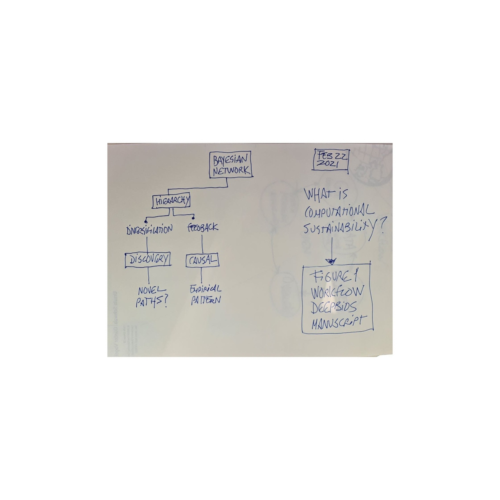

# Deepbios
Evolving computational sustainability in changing exploited ecosystems

### Workflow (open, decentralized, reproducible)

### Link to the data
(Sustainability of the Oceans)
https://drive.switch.ch/index.php/s/XtYYz37O3pqs8s1

(Fishing data)
https://globalfishingwatch.org/data-download/

### GOAL
Implementation of eco-evolutionary diversification-inspired solutions to perform computational sustainability causal infernce and discovery based on rapidly diversifying traits and interactions. The exploitation of emerging interactions, strategies and traits will allow us to create novel discovery solutions for natural ecosystems facing sustainability challenges like overexploitation of the ocean, where harvesting renewable resources are beyond the diminishing returns for many species and ecosystem resources.

### Main question
How does diversification in technology and traits discover novel paths for resource sustainability in species-rich ecosystems?
 

METHODS
1. Standarize data to account for units, missing data and sampling bias
2. Bayesian probabilitic causal graph (BPCG) accounting for 
sampling heterogeneity and bias. For example, technology in the form of gears in fishing can be represented as a node and new technologies improving catchability or other fishing properties can be modeled as diversifying to explore novel paths (See cartoon in Main question) 
3. Write down the full BPCG as conditional probability tables from each node (i.e., drawn given the parent node and the data) from which we can estimate differential strength between each gear and each fish species. Data comes from the data to fill out the BPCG to explore the total sampling heterogeneity and bias. 

WORKING PAPER 
https://www.overleaf.com/project/5f772ed0806c630001fffc3a
