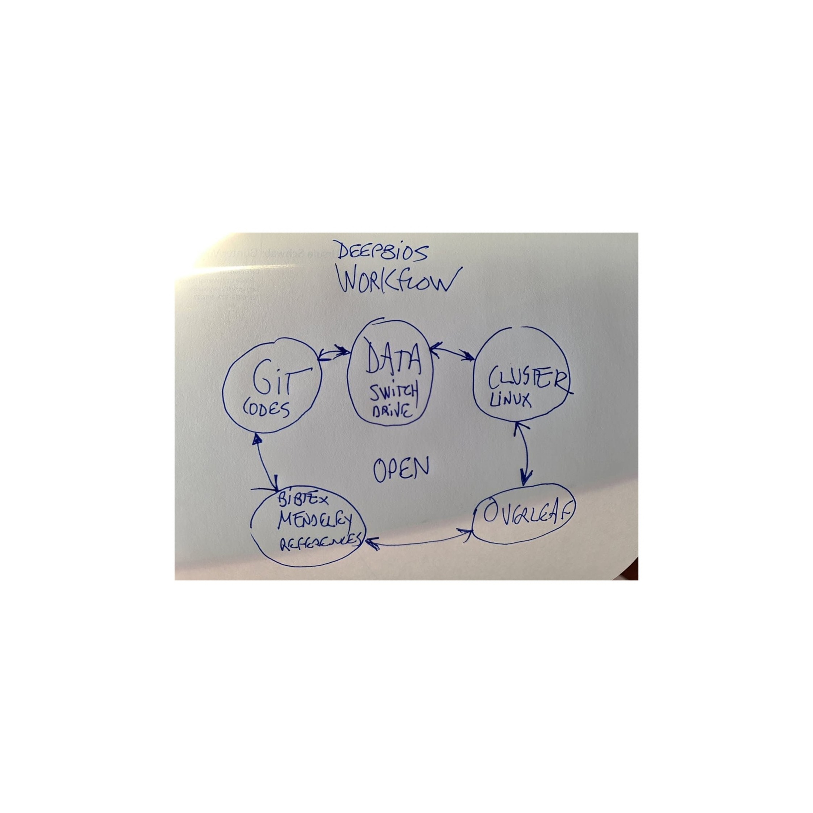

# Deepbios
Evolving computational sustainability in rapidly changing exploited ecosystems

# Workflow

## Link to the data
(Sustainability of the Oceans)
https://drive.switch.ch/index.php/s/XtYYz37O3pqs8s1

(Fishing data)
https://globalfishingwatch.org/data-download/

GOALS
Which is the heterogeneity of the data? 
How can we use AI to quantify sampling heterogeneity (missing data) and bias (gear, country, time, etc)?
How do biodiversity patterns are affected by heterogeneity and sampling bias?

METHODS
1. Standarize data to account for different parts of the data having different units
2. Write down the structure of the Bayesian probabilitic causal graph (BPCG) accounting for 
sampling heterogeneity and bias. For example, gears should be represented as a node. 
3. Write down the full BPCG as conditional probability tables from each node (i.e., drawn given the parent node and the data) from which we can estimate differential strength between each gear and each fish species. Data comes from the data to fill out the BPCG to explore the total sampling heterogeneity and bias. 

WORKING PAPER 
https://www.overleaf.com/project/5f772ed0806c630001fffc3a
